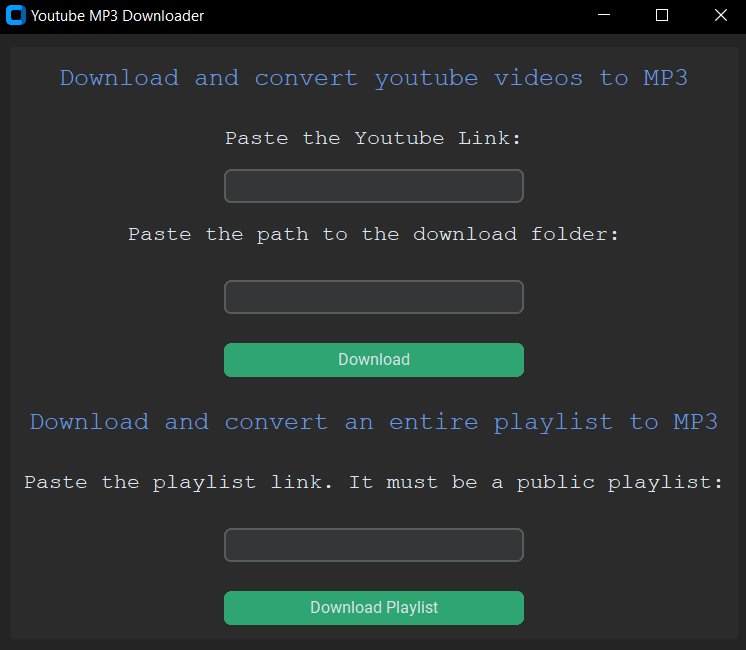

# About

A Pyhton GUI app for downloading youtube videos and converting them to mp3 plays. Can download individual videos and playlists. This application is for demonstration purposes only.

## Table of Contents

- [Local Setup](#local-setup)
- [Usage](#usage)
- [Technologies](#technologies)
- [License](#license)

## Local Setup

Download or clone the GitHub Project

Install the project requirements with this pip command:

`pip install -r requirments txt``

Run the file sorter with the following command:

`python youtube_downloader_gui.py``

Alternatively, download the exe and run that

## Usage

Paste in the link to the youtube video you want to download.
Paste in the path to the download folder.
Click Download.

Alternativley, download and convert every video in a playlist to MP3 by making the playlist public and pasting in the link. 

## Technologies

- Python
- Custom Tkinter
- PyTube

## Status

Completed

## License

You can find the License for this project [here](LICENSE.md)

This project is licensed under the terms of the MIT license.
